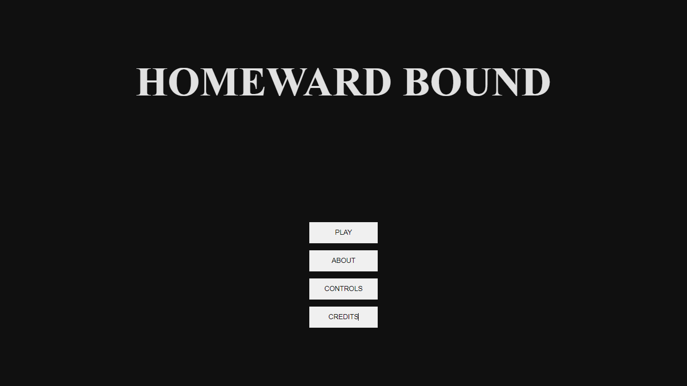
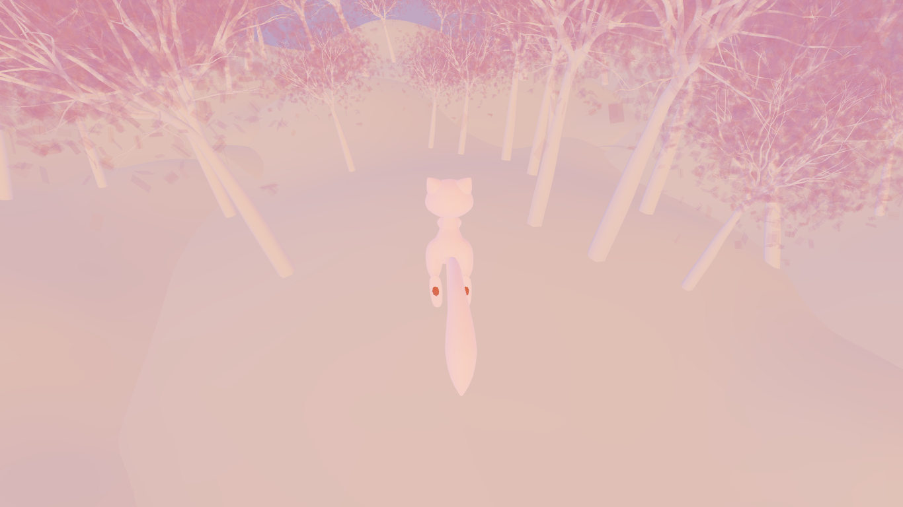

# Homeward Bound

A game about Time, Kindness and Home (^-^)

## Getting Started

To get started, follow these steps:

1. Clone the repository: git clone `https://github.com/Ruchita1010/homeward-bound.git`
2. Install dependencies: npm install
3. Start the development server: npm run dev
4. Open the application in your browser: `http://localhost:5173`

## Preview

### Start Screen

### Game Screen

## Demo

👉 [Live Demo](https://ruchita1010.github.io/homeward-bound)
